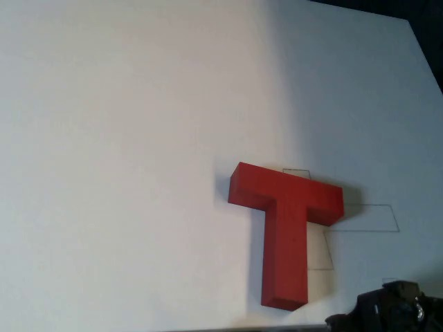
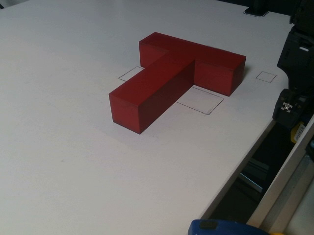
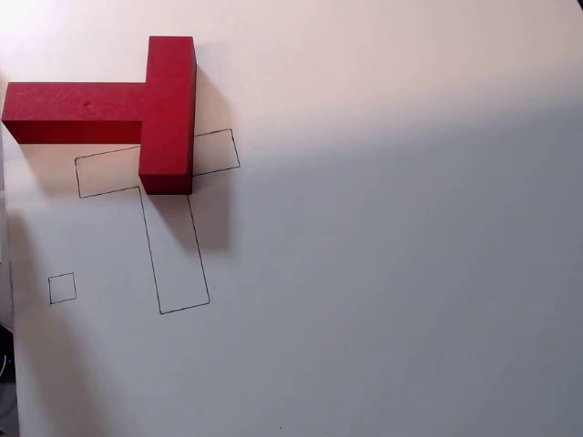
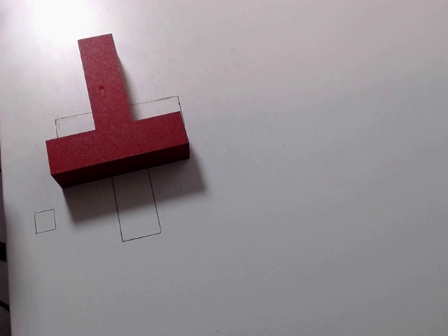
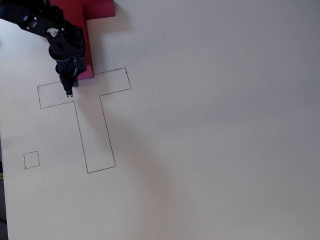

# The WidowX Push-T rig: setup specification and porting guide

---

# Part 1 — The setup

**Collected data**: **151 episodes, ~73 000 steps** of VR teleoperation, recorded at 20 Hz, episodes running 183–998 steps
(mean ≈ 608).

## 1.1 Robot and control contract

| Property | Value |
|---|---|
| Arm | Trossen WidowX 250, 6-DOF |
| Stack | `bridge_data_robot_pusht` → ROS inside Docker → `widowx_env_service` |
| Action | `[dx, dy]` planar EEF delta, **metres**, clipped to **±0.008 m** per step, script accepts action chunking and receding horizon |
| Action deadband | 0.0015 m, below which the component becomes exactly 0 |
| Z | locked at a fixed height, `lock_z=True` (see [§1.4](#14-the-z-axis-problem-and---control-z)) |
| Yaw | fixed, `fix_zangle = 0.1` |
| Gripper | closed, `fixed_gripper = 0.0`, plus an explicit `move_gripper(0.0)` after reset |
| Control rate | **20 Hz**, `move_duration = 0.05 s` (collection measured 0.0503 s/step) |
| Workspace box | x ∈ [0.10, 0.45], y ∈ [−0.15, 0.25], z ∈ [−0.01, 0.25] m |
| Start pose | EEF ≈ (0.117, −0.019, 0.02) m |

The observation dict returned by the server contains a `state` vector laid out
as `[x, y, z, r0, r1, r2, gripper]`. So `state[0:2]` is EEF xy.

## 1.2 Cameras

Two fixed RGB cameras. No wrist camera. Depth is available from the RealSense but no policy here consumes it.

Their **registration order is load-bearing**, it defines the dataset camera id that every checkpoint refers to.

| Dataset id | Device | ROS topic | Dataset keys |
|---|---|---|---|
| **0** | Intel RealSense D415 | `/D415/color/image_raw` | `images0` / `video0` |
| **1** | Logitech "1080P Pro Stream" webcam, called *blue* after its ROS namespace | `/blue/image_raw` | `images1` / `video1` |

Common properties:

- **Resolution 640 × 480 RGB**, published as `sensor_msgs/Image`. The client
  tells the service the native geometry (`im_size=480`, `im_width=640`)
- **Rate ≥ 20 Hz required.**
- Frames are pulled **synchronously inside the control loop** via
  `client.get_observation()`. There is no separate camera thread, so the
  effective camera rate is the control rate.

### Example frames

**Camera 0 — RealSense, the oblique second view.**





**Camera 1 — blue Logitech, the policy view.**





**What the policy actually receives.** Camera 1 after preprocessing: resized
640 × 480 → **320 × 240** with `cv2.INTER_AREA`, still `uint8` in [0, 255].



## 1.3 Known rig quirks

- **Z sag** — the largest open problem here, with consequences for how you train, not just how you deploy. It has its own section:
  [§1.4](#14-the-z-axis-problem-and---control-z).
- **Idle-action spike.** **24 % of demonstrated actions are exactly `(0,0)`** —
  the teleoperator pausing. Those frames are visually near-static.
- **numpy must be < 2** on the client, and `opencv-python==4.10.0.84`. The
  server runs numpy 1.x; numpy 2.x arrays fail to unpickle server-side as
  `numpy._core`.

## 1.4 The z-axis problem and `--control-z`

### What goes wrong

The task is planar: the pusher is supposed to hold a constant working height
(~0.02 m above the table) and only translate in xy, but the measured
EEF z droops as a near-linear function of arm extension:

| EEF x | measured z error |
|---|---|
| 0.12 (start pose) | +5.6 mm |
| 0.47 (far side of the board) | +34.3 mm |

### `--control-z`

`--control-z [HEIGHT]` (bare flag = the configured `fixed_z_height`, 0.026 m)
replaces the environment's P-only lock with a client-side **integrating** loop.

If we choose this flag, we control the height better but train and test differ.

# Part 2 — Running your own policy

## 2.1 Required

1. A **policy** mapping a `(1, C, 240, 320)` `uint8` tensor — plus an optional
   `(1, 2)` conditioning tensor (EEF pose) — to a normalized action in `[-1, 1]` of width
   `2·K`, where `K` is the action-chunk length (1 if unchunked).
2. A **checkpoint directory** carrying enough metadata to rebuild the model and
   denormalize its output ([§2.2](#22-files)).

## 2.2 Files

A client reads a checkpoint directory containing:

```
config.json        # architecture + input geometry (what your class object needs to be initialized)
  <weights>.pt       # plain state_dicts; convention is `<name>.pt`
```

### `config.json` example

```json
{
  "active_env": "pusht_real_pixels",
  "environments": {
    "pusht_real_pixels": {
      "env_id": "PushTRealRobot-v0",
      "state_dim": [6, 240, 320],
      "action_dim": 2,
      "action_bounds": [-1.0, 1.0],
      "frame_stack": 2,
      "camera_streams": ["video0","video1"],
      "image_height": 240,
      "image_width": 320,
      "encoder_target_height": 180,
      "encoder_target_width": 240,
      "model": { "...": "architecture hyperparameters" }
    }
  }
}
```

`state_dim` is `[3·n_cam·frame_stack, image_height, image_width]`.
